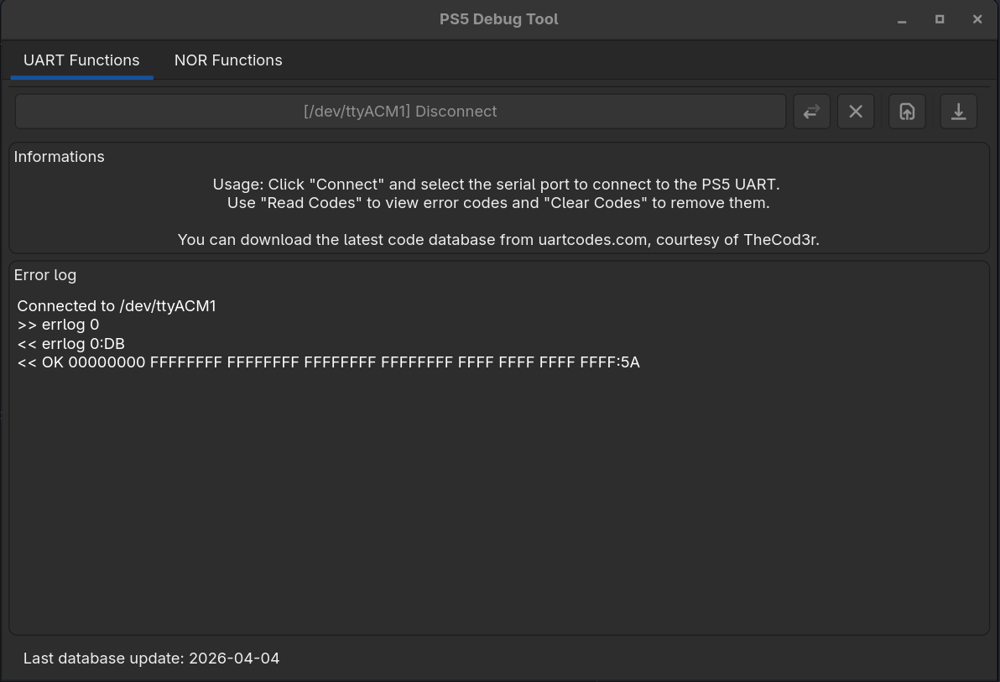
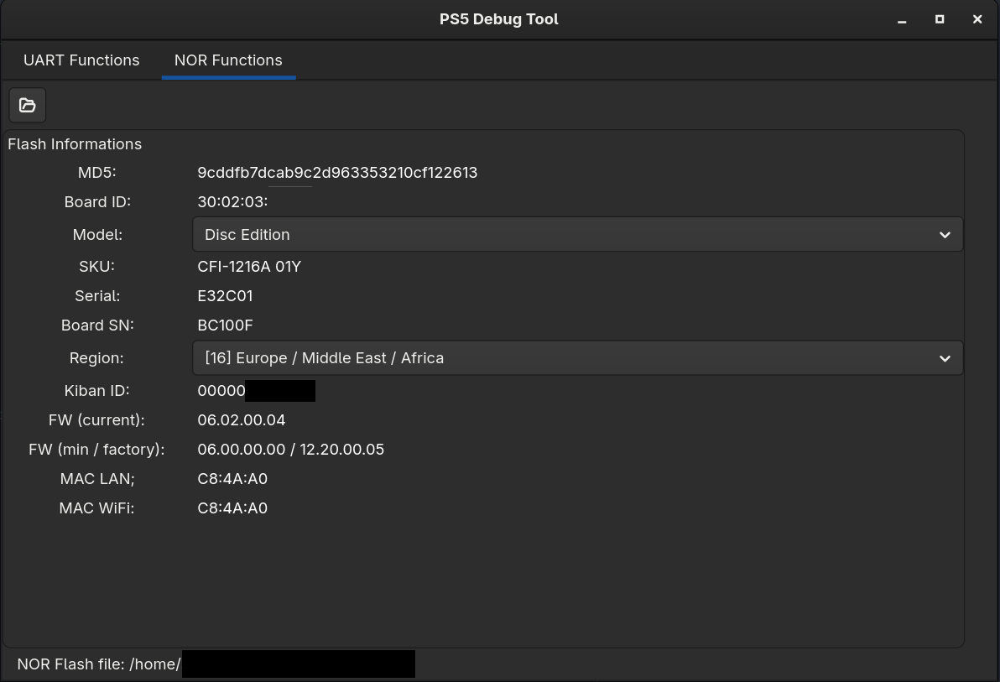

# gPS5Tool
GTK based tool for PS5 UART / NOR Flash parsing

Very early version - works but is not polished :)

This tool can talk to the PS5 southbridge via UART and read the error log. If it finds an error it can look it up
in the code database downloaded from uartcodes.com.



It can also read NOR flash data and display a bit of information about it.




## Required libraries for compilation
- gtkmm-4.0-devel
- libsq3-devel
- libcurl-devel
- openssl-devel


## Compilation instructions

Required is:
- ninja
- cmake >= 3.31
- g++

```bash
git clone https://github.com/legroeder2k/gPS5Tool.git
cd gPS5Tool
mkdir build
cd build
cmake .. -GNinja
ninja
```

The executable is in the build directory below src/gPS5Tool-gui

# Attributions

Thanks to TheC0d3r for allowing me to use his error code database on uartcodes.com :)